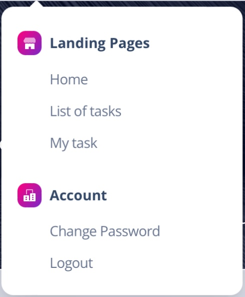
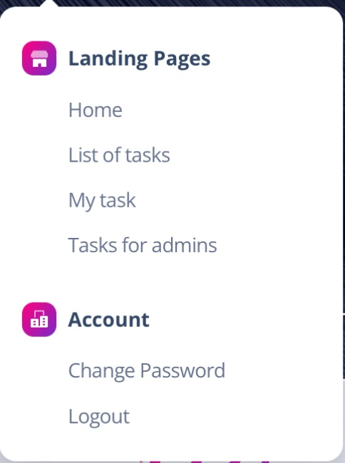
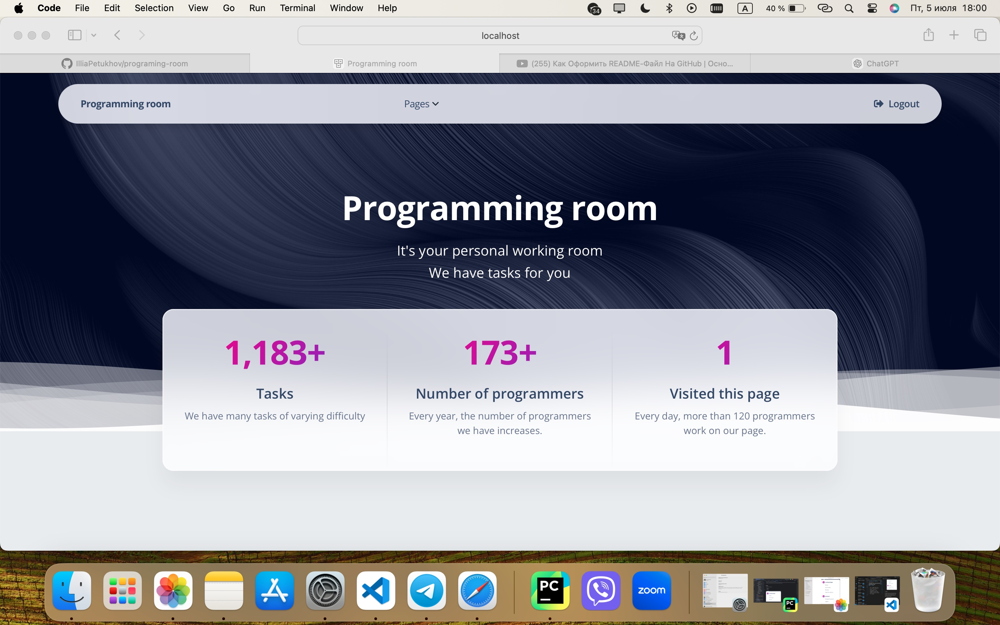
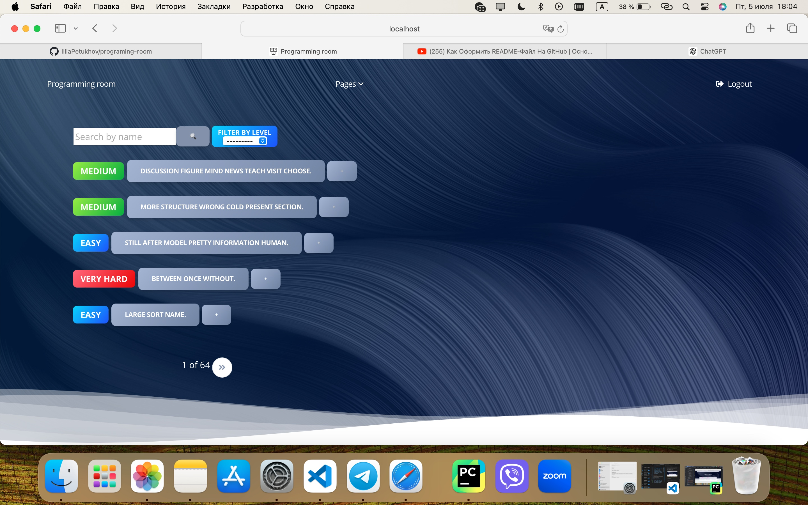
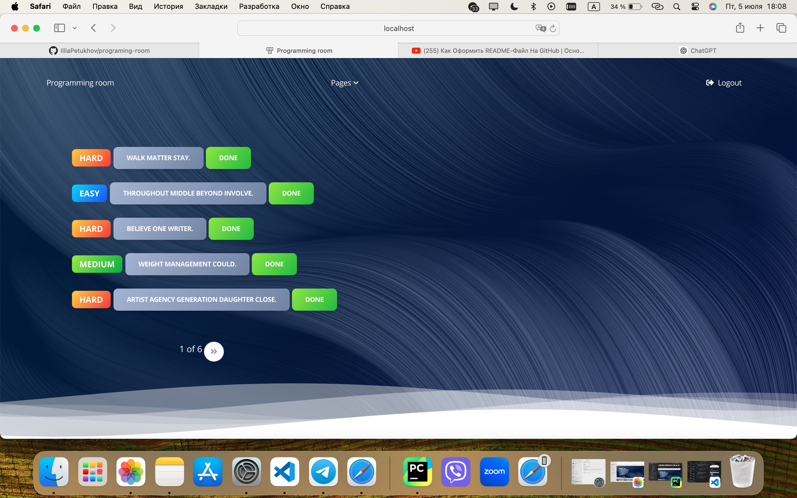
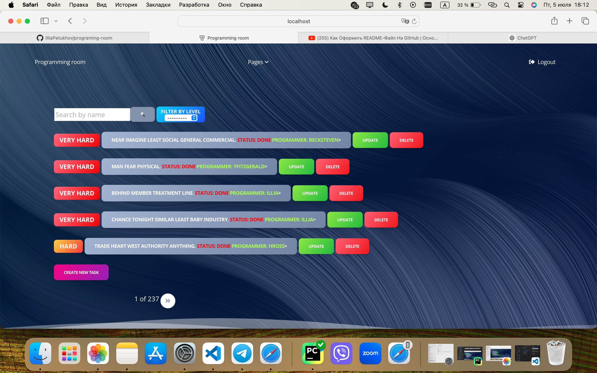

# Programing room 
___
## Description about this poject

 *This project is a virtual workspace where you can see tasks with 4 levels of difficulty. You can take a task and complete it. My idea was to create virtual workspace for some freelance company that wants to make work more comfortable and enable remote work*
___
## Pages
 *We have 3 pages for programmer:*
 + **Home** 
 + **List of tasks**
 + **My tasks**
  
    
   
*And one more extra page for admins:*    
+ **Tasks for admins**

#### 1. `Home`

   **It's page where you can see the count of tasks, count of programmer in the company and how many times you have visited this page**

#### 2. `List of tasks`

   **It's page where you can see all tasks that company has**

   

#### 3. `My tasks`

   **It's page where you can see all tasks that you have taken**

   

#### 3. `Tasks for admins`

   **It's page to control all tasks if you are an admin. On this page, you can:**
   + Update tasks
   + Delete tasks
   + Create tasks
  

___
## You have to install package using this command
`pip install django`

## Use this command for start the project 
`python manage.py runserver`

## You can use this account for this website
`username: user` 
`password: user12345`